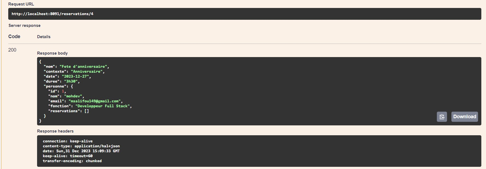
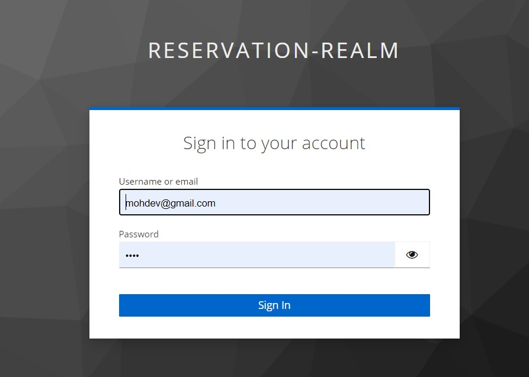

## Description du projet
On souhaite créer une application basée sur une architecture micro-service qui permet de gérer des réservations
concernant des ressources. Chaque réservation concerne une seule ressource. Une ressource est définie par son
id, son nom, son type (MATERIEL_INF0, MATERIEL_AUDIO_VUSUEL). Une réservation est définie par son id, son
nom, son contexte, , sa date, sa durée. Chaque réservation est effectuée par une personne. Une personne est
définie par son id, son nom, son email et sa fonction.
L’application doit permettre de gérer les ressources et les réservations. Pour faire plus simple, cette application
se composera de deux micro-services fonctionnels :
• Un Micro-service qui permet de gérer des « Resources-Service ».
• Un Micro-service qui permet de gérer les réservations effectuées par des personnes.
Les micro-services technique à mettre en place sont :
• Le service Gateway basé sur Spring cloud Gateway
• Le service Discovery base sur Eureka Server ou Consul Discovery (au choix)
• Le service de configuration basé sur Spring cloud config ou Consul Config (au choix)
Pour l’application, nous avons besoin de développer une frontend web, basé sur Angular Framework.
La sécurité de l’application est basée sur Oauth2 et OIDC avec Keycloak comme Provider
Pour les micro-services, il faut générer la documentation des web services Restfull en utilisant la spécification
OpenAPIDoc (Swagger). Prévoir aussi des circuit breakers basés sur Resilience4J comme solution de fault
tolerence

## Architecture du projet

## Démo de l'application
https://github.com/Moh2106/gestion_reservation/assets/83918154/803e7ac4-15a0-4d68-8954-828027c3432e

## Architecture de la base de donnée

### Base de donnée personne

### Base de donnée ressource

### Base de donnée reservation

## Consul Discovery

## Documentation swagger de ressource micro-service
- 
- 
- 
- 
- 

## Documentation swagger de personne micro-service
- 
- 
- 

## Documentation swagger de reservation micro-service
- 
- 
- 
- 
- 
- 

## Frontend Angular
> [!NOTE]
> Authentification keycloak angular :
  
> Menu de l'application frontend : 
> Menu de l'application frontend : 
> Personne Interface : 
> Reservation Interface : 
> Ressource Interface : 

